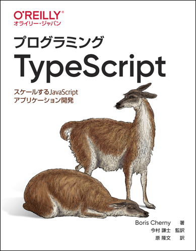

# プログラミングTypeScript

---

---

本リポジトリはオライリー・ジャパン発行書籍『[プログラミングTypeScript](http://www.oreilly.co.jp/books/9784873119045/)』（原書名『[Programming TypeScript](http://shop.oreilly.com/product/0636920158059.do)』）のサポートサイトです。

## 構成

|フォルダー名           |説明 |
|:--                    |:--  |
|[answers](./answers)   |練習問題の答え |
|[furoku-h](./furoku-h) |日本語版オリジナルの「付録H ESLintとAST」のサンプルコード |

## 正誤表

本書の正誤情報は以下のページで公開しています。

https://github.com/oreilly-japan/programming-typescript-ja/wiki/errata

本ページに掲載されていない誤植など間違いを見つけた方は、[japan＠oreilly.co.jp](<mailto:japan＠oreilly.co.jp>)までお知らせください。

## TypeScriptのバージョンについて

本書の原著は2019年5月に出版されたもので、その時点でのTypeScriptの最新バージョンである、3.4までの機能がおおむねカバーされています。また翻訳にあたり、翻訳時点での最新バージョンである3.8までに変更のあった機能については、適宜記述を修正しています。
